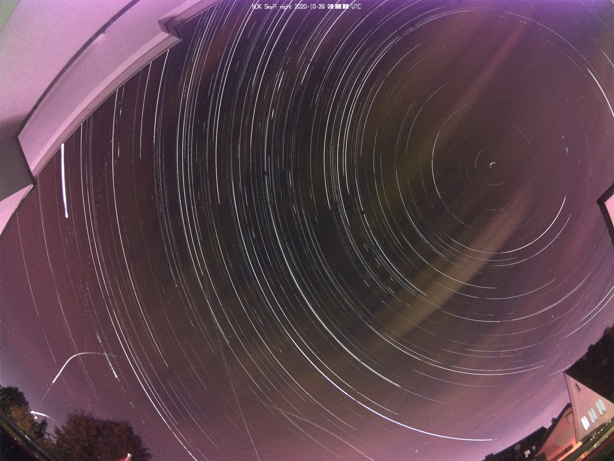
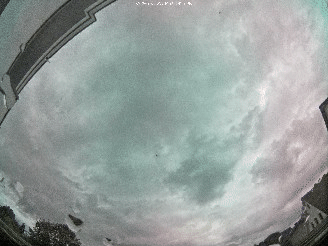
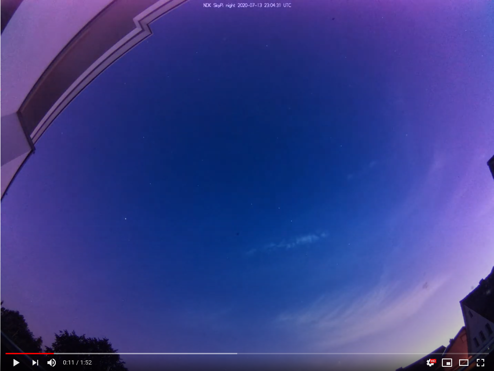

# SkyPi - Raspberry Pi Sky Timelapse Tool

SkyPi is a software to create timelapse and startrail images using a Raspberry Pi camera.

## Features

 * Automatic switch between "day" and "night" modes based on geographic location
 * Flexible Raspberry Pi Camera settings using different settings for day and night
 * Modular outputs (startrails/overlay images, preview GIFs, timelapse) with variable settings for day and night
 * Startrail image processor with exposure correction
 * Timelapse image processor using ffmpeg
 * Error recovery and resumption
 * Configurable retain times and automatic garbage collection for output files
 * Output to disk - usable with any webserver
 * Support for stable links to latest images/startrails/timelapse videos
 * Optional upload - e.g., youtube upload for timelapse videos
 * MQTT reporting
 * Watchdog for camera lockups

## Setup and Configuration

 1. Clone this repository onto your Raspberry Pi
 2. Run `pip3 install -r requirements.txt`
 3. Make sure that all external tools are available: `sudo apt install exiftool convert ffmpeg`
 4. If you want to upload your timelapses to youtube, [install and set up youtubeuploader](https://github.com/porjo/youtubeuploader). You may need to change the path to the binary in the `settings.yml` file. If you do not want to upload your timelapses, remove the `upload` setting (and the sub-settings) from `settings.yml`.
 5. Adapt the storage paths and other settings in [settings.yml](./settings.yml).
 6. Test your settings by running `python3 main.py`
 7. Ensure that SkyPi is run on every boot. Adapt [skypi.service](./skypi.service) to set up a Systemd service (see [here](https://www.linode.com/docs/guides/start-service-at-boot/) for details).

## Examples
### Thumbnail Animation

### Overlay (Startrail) Image Processor

### Timelapse

